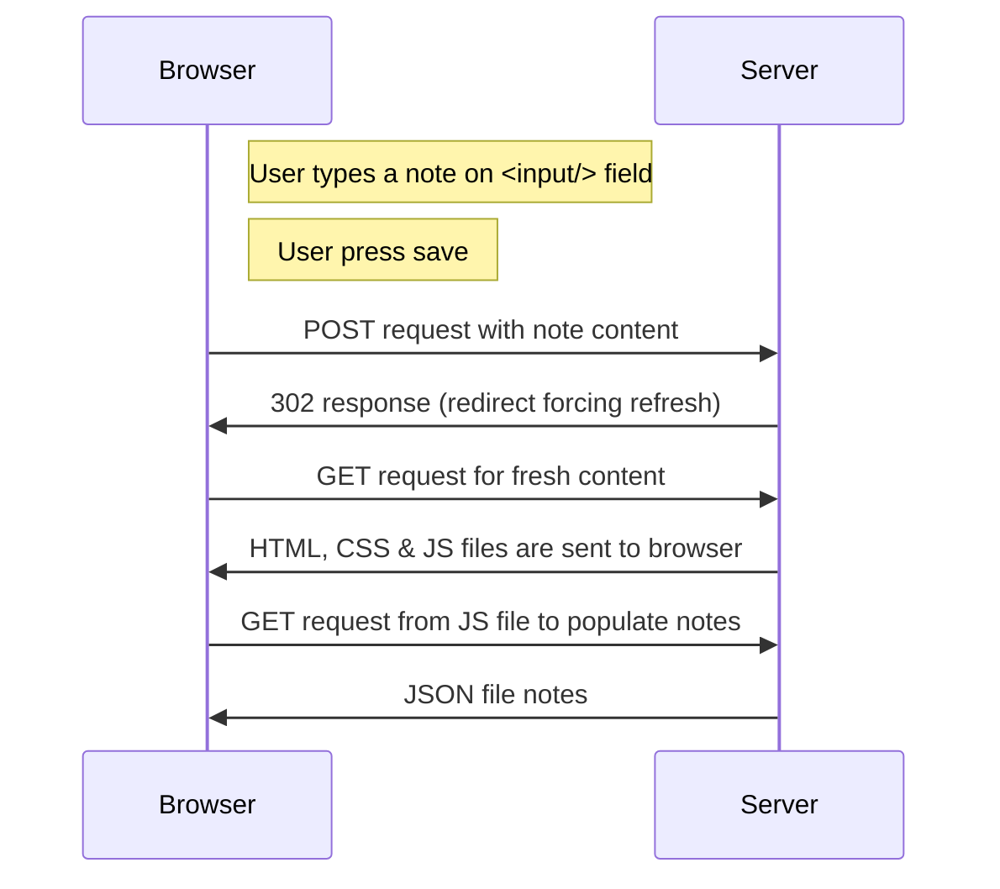

```mermaid
sequenceDiagram
Note right of Browser: User types a note on <input/> field
Note right of Browser: User press save
Browser->>Server: POST request with note content
Server->>Browser: 302 response (redirect forcing refresh)
Browser->>Server: GET request for fresh content
Server->>Browser: HTML, CSS & JS files are sent to browser
Browser->>Server: GET request from JS file to populate notes
Server->>Browser: JSON file notes
```
